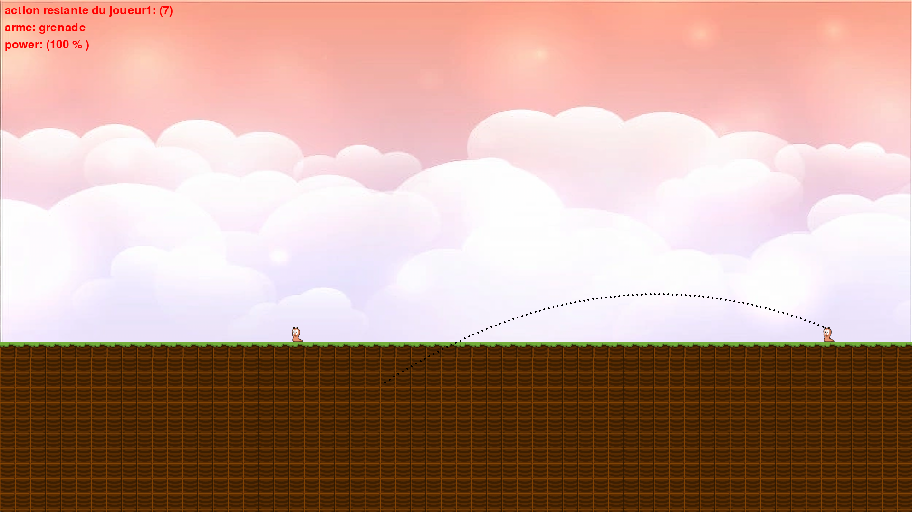

# Recréation de Worms avec Pygame

Ce projet consiste à recréer le célèbre jeu *Worms* en utilisant Python et Pygame, avec un objectif éducatif centré sur l'application des équations de trajectoire. Le projet inclut un système de vent qui influence la trajectoire des projectiles, simulant des conditions de tir réalistes.

## Objectifs du projet

- **Recréer les mécaniques de jeu de *Worms*** : Déplacements des personnages, tirs de projectiles, collisions avec l'environnement, et dommages infligés.
- **Application des équations de trajectoire** : Implémentation d'un système physique où les projectiles suivent une trajectoire parabolique, influencée par la gravité et la force du vent.
- **Système de vent** : Le vent affecte la trajectoire des projectiles, ajoutant un niveau de complexité à la mécanique de tir.

## Fonctionnalités principales

- **Simulation des trajectoires** : Calculs physiques prenant en compte l'angle de tir, la vitesse initiale, la gravité et le vent pour définir la courbe de vol des projectiles.
- **Personnages jouables** : Gestion des déplacements et des actions des personnages sur la carte.
- **Influence du vent** : Le vent peut modifier la direction et la portée des projectiles, ajoutant une composante stratégique.

## Technologies utilisées

- **Python** : Langage de programmation principal.
- **Pygame** : Bibliothèque utilisée pour gérer les graphiques, l'audio, et les événements de jeu en temps réel.

